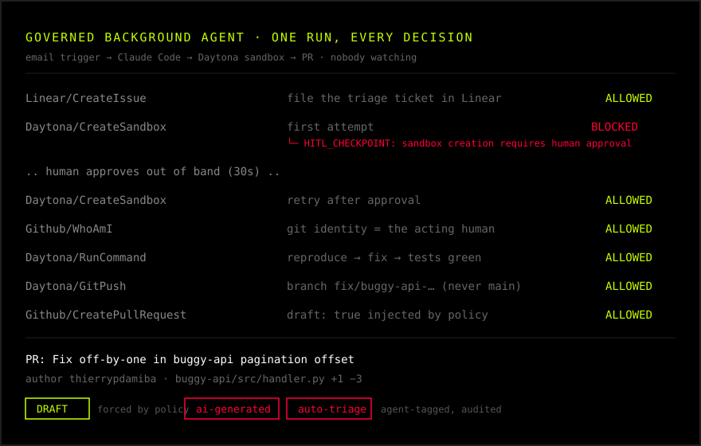

# How a governed background agent actually works

*Draft — technical companion to [How Does Arcade.dev Work With My Background Agents?](https://www.arcade.dev/blog/arcade-background-agents). Target: AI developers evaluating this for production. Every code block below is from a working repo: [arcadeai-labs/daytona-background-agents](https://github.com/arcadeai-labs/daytona-background-agents).*

Our last post on background agents made four claims: authorization is delegated rather than shared, permissions are checked at the moment of action, the agent waits when consent is genuinely needed, and every action stays attributable. Those are the right claims. This post is what they look like in running code.

The demo we'll walk through is a background support engineer. An email arrives describing a bug. With nobody watching, an agent files a Linear ticket, spins up a Daytona sandbox, reproduces the bug, fixes it, opens a PR, updates the ticket, and posts a summary to Slack. The interesting part is not that it can do this. The interesting part is everything that constrains it while it does.

## Who owns the trigger (spoiler: you do)

A background agent is one that runs on a schedule or a trigger instead of a chat session, and the first honest thing to say is that Arcade doesn't provide the trigger. In this demo the trigger is a shell script that polls Gmail and launches Claude Code when a matching email lands. In your stack it might be cron, a webhook, a CI job, or a workflow engine like Inngest. That's your layer, built from whatever already fires events in your infrastructure.

This is a deliberate boundary, and it's worth being precise about because it's where the security question actually lives. Waking an agent up is easy and safe. The dangerous part is what the agent can do once awake, and that's the layer Arcade owns: every tool call the agent makes from its first breath runs through the Arcade gateway as a specific, delegated user, against policy evaluated at that moment.

The handoff between the layers is small enough to quote in full. When the poller sees an email, it launches the agent with this:

```
Use the support-triage skill. A support email just arrived that needs
investigation and resolution.

Subject: ${subject}

Body:
${body}

The buggy repo is ${DEMO_REPO_URL}. The skill does the rest.
```

Three lines of intent. The entire procedure lives in a versioned markdown file, [`.claude/skills/support-triage/SKILL.md`](https://github.com/arcadeai-labs/daytona-background-agents/blob/main/.claude/skills/support-triage/SKILL.md), that the harness loads on its own. The runtime is a commodity. If you switch harnesses next quarter, the skill and the governance come with you.

## The agent holds a reference to authority, not the authority

The only identity in the system is an `ARCADE_USER_ID` passed with every tool call. The user granted OAuth access to Gmail, Linear, GitHub, Slack, and Daytona once, ahead of time. Arcade holds those tokens in encrypted storage, refreshes them on its own, and injects them at execution. The token never enters the agent's context window, which means the agent can't leak what it never had.

This is what "delegated authority" means mechanically. When the agent files the Linear ticket, the ticket is created by the human the agent acts for, via that human's grant, scoped to that tool. There is no bot user, no shared service account, and when the PR opens later, `git log` shows a real name because the skill's first sandbox step is to ask `Github.WhoAmI` and configure git identity from the answer.

## Policy is a webhook, and a deny is a message the agent can read

Here is the entire governance layer of the demo. Not an excerpt, the whole thing:

```yaml
pre:
  default_action: proceed
  rules:
    # HITL: block sandbox creation until a human approves
    - toolkit: "Daytona"
      tool: "CreateSandbox"
      action: block
      error_message: "HITL_CHECKPOINT: Sandbox creation requires human approval."

    # Block direct pushes to main
    - toolkit: "Daytona"
      tool: "GitPush"
      input_match: "branch contains main"
      action: block
      error_message: "Direct push to protected branch blocked. Use a feature branch."

    # Force every agent-opened PR into draft
    - toolkit: "Github"
      tool: "CreatePullRequest"
      action: proceed
      override:
        inputs:
          draft: true
```

Arcade's contextual access hooks call your policy endpoint before every tool execution, with the tool name, the inputs, and the acting user. Your endpoint answers proceed, block, or proceed-with-overrides. Three rules, three distinct flavors of control:

**Stop.** `CreateSandbox` is blocked pending a human. The part that makes this work unattended is the shape of the denial. The agent receives it as a tool error it can read:

```
HITL_CHECKPOINT: Sandbox creation requires human approval.
```

The skill tells the agent that `HITL_CHECKPOINT` is a governance checkpoint rather than a failure, so it explains what it wanted to do and retries after a pause. Approval happens out of band. A human (or an approval watcher, or your ticketing system) flips the rule via the policy server's admin API, the retry sails through, and the block gets restored for next time. No agent code changed. No tool code changed. The agent didn't crash and didn't escalate; it waited. That's the "agent waits instead of faking it" claim, implemented in one rule and one error message.

**Constrain.** The branch-protection rule matches on inputs, not just tool names. The agent can push all day to `fix/buggy-api-20260706-141530`, and physically cannot push to `main`. So "the AI opened a PR for review" is a property the system enforces, not a behavior you hope the model exhibits.

**Stamp.** The third rule doesn't block anything. It rewrites the inputs on the way through, forcing `draft: true` onto every `CreatePullRequest` call the agent makes. So an agent physically cannot open a ready-to-merge PR; every one arrives as a draft that a human has to promote. The agent can pass `draft: false`; the gateway overwrites it. This is worth dwelling on, because the tempting version, telling the agent in its prompt to always open drafts, is exactly the guarantee you don't have: a prompt is a request, and the whole point of governance is the thing the agent can't talk its way out of. The override is on a real parameter the tool accepts, enforced gateway-side.

It's worth being precise about what enforcement can and can't reach here, because the honest version is more useful than the tidy one. `CreatePullRequest` has no `labels` field, so the gateway cannot stamp a label onto the PR at creation the way it stamps `draft`. The `ai-generated` labels you see on the PR come from a separate step in the agent's procedure, where it tags its own work via a labeling tool after the PR exists. That's a convention the audit log records, not an injection the agent can't avoid. The distinction matters: the draft is a guarantee, the label is a habit. Reach for an input override when the parameter exists on the call you're already governing; reach for policy on the labeling call itself when you need the label to be a guarantee too.

## Just-in-time means the answer can change while the job sleeps

The reason policy runs as a hook at execution time, rather than as a check at setup time, is that background agents are where the gap between "authorized then" and "authorized now" actually bites. A human grants access at 5 p.m. The job fires at 2 a.m. Anything can happen in those nine hours: the user's role changed, their access was downgraded, the policy tightened.

Because the hook fires on every call, the running agent feels the change on its next action. In the demo you can watch this live: restore the sandbox block while the agent is mid-task and its next `CreateSandbox` call is denied, with the denial logged. An authorization that was valid when the job was scheduled can be invalid by the time it runs, and the gateway enforces the current answer.

## The audit trail is queryable, not aspirational

Every hook invocation is logged with the endpoint, the tool, the inputs, and the decision. Here is one real run of this demo, from the email trigger to the open draft PR, every governed decision in order:

```
Linear/CreateIssue        ALLOWED   file the triage ticket
Daytona/CreateSandbox     BLOCKED   HITL_CHECKPOINT: needs human approval
  .. human approves out of band (30s) ..
Daytona/CreateSandbox     ALLOWED   retry after approval
Github/WhoAmI             ALLOWED   git identity = the acting human
Daytona/RunCommand        ALLOWED   reproduce → fix → tests green
Daytona/GitPush           ALLOWED   branch fix/buggy-api-… (never main)
Github/CreatePullRequest  ALLOWED   draft: true injected by policy
```

That produced a draft PR, authored by the human the agent acted for, touching one file (`buggy-api/src/handler.py`, +1 −3), opened as a draft the agent couldn't opt out of:



In production this stream goes to your SIEM over OpenTelemetry, attributed to the user the agent acted for. When someone asks "what did the agent do last night, and who let it," the answer is a query rather than a forensic project.

## What this adds up to

The stack has three layers with clean seams. The trigger is yours: a hundred lines of bash here, any event source in production. The procedure is a markdown file you can version, review, and ship like code. The governance is config, enforced gateway-side on every call, which is why none of it depends on the agent being well behaved.

The model plans. Arcade is the reasoning and action layer underneath it, and for background agents specifically, it's the difference between an agent you can run unattended and one you merely hope behaves. Clone [the repo](https://github.com/arcadeai-labs/daytona-background-agents), plant your own bug, and watch it hit the wall.
